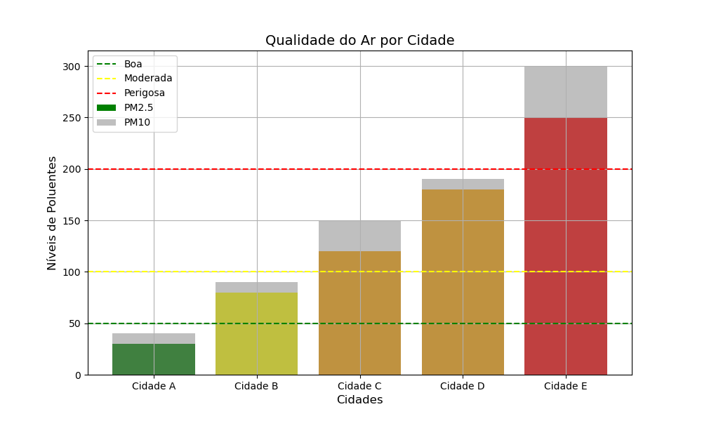

# Portfólio 4 - Inteligência Artificial

## Agente Baseado em Conhecimento

Os agentes baseados em conhecimento desempenham um papel central na inteligência artificial (IA), pois empregam raciocínio lógico sobre um conjunto estruturado de informações para tomar decisões e agir em um ambiente. Esses agentes se destacam por sua capacidade de integrar informações novas e realizar inferências, o que os torna particularmente adequados para ambientes complexos e parcialmente observáveis.

#### O que é um Agente Baseado em Conhecimento?

Um agente baseado em conhecimento é um sistema capaz de realizar ações inteligentes utilizando uma **base de conhecimento** (Knowledge Base, KB). A base de conhecimento é composta por um conjunto de sentenças que representam informações sobre o mundo, expressas em uma linguagem de representação de conhecimento, como lógica proposicional ou lógica de predicados.

Esses agentes operam por meio de dois componentes principais:

1. **TELL**: A operação que adiciona novas informações à base de conhecimento.
2. **ASK**: A operação que consulta a base de conhecimento para recuperar ou inferir informações relevantes.

Essas operações são frequentemente auxiliadas por processos de inferência, permitindo ao agente derivar novas sentenças com base nas que já existem. Esse modelo possibilita uma abordagem mais flexível e robusta em comparação com agentes que seguem um conjunto fixo de regras.

#### Abordagens Declarativa e Procedural

A construção de um agente baseado em conhecimento pode seguir duas abordagens principais:

1. **Abordagem Declarativa**: Consiste em iniciar com uma base de conhecimento vazia e, progressivamente, adicionar sentenças que descrevem o ambiente. Essa abordagem é ideal para sistemas onde a explicabilidade e a adaptabilidade são cruciais.
   
2. **Abordagem Procedural**: Nesta abordagem, os comportamentos desejados são codificados diretamente no programa. Embora seja menos flexível, é mais eficiente em cenários de alta previsibilidade.

#### Micromundos e Exemplos Clássicos

Os agentes baseados em conhecimento são frequentemente estudados em micromundos – ambientes simplificados que permitem testar e validar conceitos de IA. Um dos exemplos mais conhecidos é o **Wumpus World**, um cenário hipotético que desafia o agente a encontrar um tesouro enquanto evita perigos, como poços e o monstro Wumpus.

#### Exemplo: O Problema do Diagnóstico Médico

Outro exemplo famoso que ilustra o uso de agentes baseados em conhecimento é o sistema de diagnóstico médico. Nesse contexto, o agente é responsável por diagnosticar doenças com base em sintomas apresentados por pacientes. O sistema possui:

1. **Base de Conhecimento (KB)**:
   - Representa informações sobre doenças, sintomas e relações causais entre eles, como:
     - "Se febre alta e dor de cabeça, pode ser meningite."
     - "Se dor de garganta e febre leve, pode ser faringite."

2. **Processo de Inferência**:
   - Dado o conjunto de sintomas relatados, o agente consulta a base de conhecimento para inferir a doença mais provável.
   - Exemplo: Se um paciente relata febre alta e dor de cabeça, o sistema pode deduzir meningite como um diagnóstico possível, com base na regra descrita.

3. **TELL e ASK**:
   - A operação TELL permite ao agente atualizar a base de conhecimento com novas informações sobre doenças ou padrões de sintomas.
   - A operação ASK permite consultar a base para fazer diagnósticos ou propor tratamentos.

Este tipo de sistema é amplamente usado em assistentes médicos automatizados, como o IBM Watson Health e sistemas baseados em lógica de predicados.

#### Características dos Agentes Baseados em Conhecimento

1. **Raciocínio Flexível**: São capazes de lidar com ambientes parcialmente observáveis e dinâmicos.
2. **Inferência**: Permitem derivar novas informações a partir de conhecimento existente.
3. **Explicabilidade**: Fornecem justificativas claras para as decisões tomadas.
4. **Adaptabilidade**: Podem incorporar novas informações dinamicamente.


### Sistema de classificação de qualidade do ar
Exemplo de Agente baseado em conhecimento baseado em um **sistema de classificação de qualidade do ar**. 
Neste sistema, o agente recebe informações sobre poluentes no ar (como níveis de PM2.5 e PM10) e consulta uma base de conhecimento para classificar a qualidade do ar como "Boa", "Moderada", "Ruim" ou "Perigosa". Além disso, o agente plotará um gráfico para visualização.

### Código Python

```python
import matplotlib.pyplot as plt
import pandas as pd

# Base de Conhecimento
knowledge_base = [
    {"if": lambda pm25, pm10: pm25 <= 50 and pm10 <= 50, "then": "Boa"},
    {"if": lambda pm25, pm10: 51 <= pm25 <= 100 or 51 <= pm10 <= 100, "then": "Moderada"},
    {"if": lambda pm25, pm10: 101 <= pm25 <= 200 or 101 <= pm10 <= 200, "then": "Ruim"},
    {"if": lambda pm25, pm10: pm25 > 200 or pm10 > 200, "then": "Perigosa"},
]

# Função de Inferência
def classify_air_quality(pm25, pm10, knowledge_base):
    """
    Classifica a qualidade do ar com base nos níveis de PM2.5 e PM10.
    :param pm25: Nível de PM2.5.
    :param pm10: Nível de PM10.
    :param knowledge_base: Base de conhecimento com regras.
    :return: Classificação da qualidade do ar.
    """
    for rule in knowledge_base:
        if rule["if"](pm25, pm10):
            return rule["then"]
    return "Indefinida"

# Gerar dados de exemplo
data = {
    "Cidade": ["Cidade A", "Cidade B", "Cidade C", "Cidade D", "Cidade E"],
    "PM2.5": [30, 80, 120, 180, 250],
    "PM10": [40, 90, 150, 190, 300],
}

# Criar DataFrame
df = pd.DataFrame(data)

# Adicionar classificação ao DataFrame
df["Qualidade do Ar"] = df.apply(lambda row: classify_air_quality(row["PM2.5"], row["PM10"], knowledge_base), axis=1)

# Exibir tabela com as classificações
print(df)

# Visualização: Gráfico de barras para qualidade do ar
plt.figure(figsize=(10, 6))
colors = {"Boa": "green", "Moderada": "yellow", "Ruim": "orange", "Perigosa": "red"}
plt.bar(df["Cidade"], df["PM2.5"], color=[colors[quality] for quality in df["Qualidade do Ar"]], label="PM2.5")
plt.bar(df["Cidade"], df["PM10"], color="gray", alpha=0.5, label="PM10")

plt.title("Qualidade do Ar por Cidade", fontsize=14)
plt.xlabel("Cidades", fontsize=12)
plt.ylabel("Níveis de Poluentes", fontsize=12)
plt.axhline(50, color="green", linestyle="--", label="Boa")
plt.axhline(100, color="yellow", linestyle="--", label="Moderada")
plt.axhline(200, color="red", linestyle="--", label="Perigosa")
plt.legend()
plt.grid(True)
plt.show()
```

### Explicação do Código

1. **Base de Conhecimento**:
   - A base de conhecimento contém regras declarativas, onde cada regra define um intervalo de níveis de poluentes para classificar a qualidade do ar (Boa, Moderada, Ruim, Perigosa).

2. **Função de Inferência**:
   - A função `classify_air_quality` avalia os níveis de PM2.5 e PM10 contra as condições das regras na base de conhecimento. A primeira regra satisfeita retorna a classificação.

3. **Gerar Dados de Exemplo**:
   - Criamos um conjunto fictício de dados com os níveis de PM2.5 e PM10 para diferentes cidades.

4. **Visualização**:
   - Um gráfico de barras exibe os níveis de poluentes por cidade, com cores que representam a classificação da qualidade do ar.
   - Linhas de referência mostram os limites das classificações, auxiliando na interpretação visual.

### Saída Esperada

#### Tabela no Terminal:
```
     Cidade  PM2.5  PM10 Qualidade do Ar
0  Cidade A     30    40             Boa
1  Cidade B     80    90        Moderada
2  Cidade C    120   150            Ruim
3  Cidade D    180   190            Ruim
4  Cidade E    250   300        Perigosa
```

#### Gráfico de Barras:
- As barras para PM2.5 e PM10 são exibidas para cada cidade, com cores representando a classificação da qualidade do ar:
  - **Verde**: Boa
  - **Amarelo**: Moderada
  - **Laranja**: Ruim
  - **Vermelho**: Perigosa



#### Conclusão

Agentes baseados em conhecimento são fundamentais na inteligência artificial, pois oferecem um modelo robusto e adaptável para tomada de decisão em ambientes complexos. Seja em micromundos como o Wumpus World ou em aplicações reais, como sistemas de diagnóstico médico, eles demonstram a eficácia do uso de lógica e representação de conhecimento.

---
---


## Lógica 

A lógica é um dos fundamentos mais importantes da Inteligência Artificial (IA), sendo utilizada para representar conhecimento e realizar inferências. Em IA, a lógica é a base para criar agentes inteligentes que podem raciocinar, tomar decisões e solucionar problemas com base em um conjunto de fatos e regras.

### **Conceitos Fundamentais da Lógica**

#### **1. Sintaxe**
A sintaxe define as regras formais para construir sentenças na linguagem lógica. Uma sentença bem construída segue as regras gramaticais e de precedência dos operadores.

Exemplo de sentenças bem e mal construídas:
- Bem construída: \( P \land Q \)
- Mal construída: \( P Q \lor \land \)

#### **2. Semântica**
A semântica define o significado das sentenças, ou seja, como determinar se uma sentença é verdadeira ou falsa em um modelo específico. Um modelo é uma atribuição de valores de verdade para as proposições.

Por exemplo:
- Sentença: \( P \lor Q \)
- Modelo \( m_1 \): \( P = \text{verdadeiro}, Q = \text{falso} \)
- Resultado: Verdadeiro, pois \( P \) é verdadeiro.

#### **3. Inferência**
Inferência lógica é o processo de derivar novas sentenças com base em sentenças já conhecidas. Um algoritmo de inferência é considerado **completo** se puder derivar qualquer sentença verdadeira a partir da base de conhecimento.

Por exemplo, dado:
- \( P \Rightarrow Q \) (Se \( P \), então \( Q \))
- \( P \) é verdadeiro
- Podemos inferir que \( Q \) também é verdadeiro.

### **Tipos de Lógica**

#### **Lógica Proposicional**
A lógica proposicional trabalha com proposições que podem ser verdadeiras ou falsas. Exemplos de operadores:
- **¬ (NOT):** Negação. \( \neg P \) é verdadeiro se \( P \) for falso.
- **∧ (AND):** Conjunção. \( P ∧ Q \) é verdadeiro se ambos forem verdadeiros.
- **∨ (OR):** Disjunção. \( P ∨ Q \) é verdadeiro se pelo menos um for verdadeiro.
- **⇒ (IMPLIES):** Implicação. \( P ⇒ Q \) é falso apenas se \( P \) for verdadeiro e \( Q \) for falso.
- **⇔ (IFF):** Bicondicional. \( P ⇔ Q \) é verdadeiro se \( P \) e \( Q \) forem ambos verdadeiros ou ambos falsos.

#### **Lógica de Primeira Ordem**
Estende a lógica proposicional ao incluir variáveis, quantificadores e relações. Por exemplo:
- Quantificador Universal (\( \forall \)): "Para todo".
- Quantificador Existencial (\( \exists \)): "Existe pelo menos um".

### **Exemplo**

A seguir, apresento um exemplo simples de lógica proposicional em Python. Vamos verificar se uma sentença é verdadeira em diferentes modelos.

```python
# Modelo: Dicionário que associa proposições a valores de verdade
models = [
    {"P": True, "Q": False},
    {"P": False, "Q": True},
    {"P": True, "Q": True},
    {"P": False, "Q": False},
]

# Sentenças lógicas
def logical_and(P, Q):
    return P and Q

def logical_or(P, Q):
    return P or Q

def logical_implies(P, Q):
    return not P or Q

# Avaliar as sentenças em cada modelo
print("Modelo | P AND Q | P OR Q | P ⇒ Q")
print("-" * 32)
for model in models:
    P, Q = model["P"], model["Q"]
    and_result = logical_and(P, Q)
    or_result = logical_or(P, Q)
    implies_result = logical_implies(P, Q)
    print(f"{model} | {and_result}     | {or_result}    | {implies_result}")
```


### **Saída do Exemplo**

```
Modelo | P AND Q | P OR Q | P ⇒ Q
--------------------------------
{'P': True, 'Q': False}  | False     | True    | False
{'P': False, 'Q': True}  | False     | True    | True
{'P': True, 'Q': True}   | True      | True    | True
{'P': False, 'Q': False} | False     | False   | True
```

### **Análise do Exemplo**
1. Cada linha mostra o resultado das sentenças \( P ∧ Q \), \( P ∨ Q \) e \( P ⇒ Q \) em diferentes modelos.
2. O exemplo ajuda a visualizar como as operações lógicas funcionam em prática.

---
---


## **Processo de Inferência**

O processo de inferência é o mecanismo pelo qual novos conhecimentos são derivados a partir de fatos e regras existentes em uma base de conhecimento (KB). Esse processo é fundamental para agentes inteligentes que precisam raciocinar, solucionar problemas e tomar decisões com base em informações disponíveis.

Inferência em inteligência artificial utiliza lógica formal para garantir que as conclusões derivadas sejam consistentes e confiáveis. O uso de algoritmos de inferência permite que os agentes naveguem em cenários complexos, conectando dados e extraindo conclusões explicáveis.

### **Fundamentos do Processo de Inferência**

1. **Base de Conhecimento (KB):**
   - Uma KB contém fatos e regras que representam o conhecimento do agente sobre o mundo.
   - Exemplo: 
     - Fatos: \( P1,2 = \text{falso}, P2,2 = \text{verdadeiro} \).
     - Regras: \( P1,2 \Rightarrow \neg P2,2 \) (Se \( P1,2 \), então \( P2,2 \) não é verdadeiro).

2. **Objetivo do Processo de Inferência:**
   - Determinar se uma nova sentença (\( \alpha \)) pode ser derivada da KB.
   - Formalmente: \( \text{KB} \models \alpha \), ou seja, \( \alpha \) é verdadeira em todos os modelos em que a KB é verdadeira.

3. **Tipos de Inferência:**
   - **Dedutiva:** Conclusões garantidamente verdadeiras se os fatos e as regras forem verdadeiros.
   - **Indutiva:** Conclusões prováveis com base em observações.
   - **Abdutiva:** Infere a melhor explicação para um conjunto de dados.

### **Algoritmos de Inferência**

#### **1. Encadeamento para Frente (Forward Chaining):**
- Começa com fatos conhecidos e aplica regras para derivar novas informações.
- Útil para sistemas que monitoram eventos continuamente, como diagnósticos.

#### **2. Encadeamento para Trás (Backward Chaining):**
- Começa com uma hipótese (objetivo) e trabalha para verificar se os fatos conhecidos podem prová-la.
- Comum em sistemas baseados em regras, como mecanismos de consulta em IA.


### **Vantagens do Processo de Inferência**
1. **Flexibilidade:** Permite derivar novas informações sem conhecer todas as variáveis inicialmente.
2. **Explicabilidade:** As conclusões podem ser justificadas com base nos fatos e regras.
3. **Automatização:** Pode ser aplicado em sistemas para monitorar e reagir a mudanças no ambiente.

### **Aplicações Práticas**
- **Sistemas de Diagnóstico:** Identificar doenças a partir de sintomas.
- **Assistentes Virtuais:** Responder a perguntas com base em uma base de conhecimento.
- **Jogos de IA:** Tomar decisões racionais em ambientes baseados em regras.


### **Inferência Lógica para Identificar Problemas Elétricos**

#### Cenário:
Você quer identificar por que uma lâmpada não está acendendo. Sua base de conhecimento inclui fatos e regras:

- **Fatos:**
  1. O interruptor está ligado (\( A = \text{verdadeiro} \)).
  2. A lâmpada está conectada corretamente (\( B = \text{verdadeiro} \)).

- **Regras:**
  1. \( A \land B \Rightarrow C \) (Se o interruptor está ligado **e** a lâmpada está conectada corretamente, então a lâmpada acende).
  2. \( \neg C \Rightarrow D \) (Se a lâmpada não acende, então há um problema).

#### Implementação do Processo de Inferência em Python:

```python
# Base de Conhecimento
facts = {"A": True, "B": True, "C": None, "D": None}  # C e D são inicialmente desconhecidos
rules = [
    {"premise": ["A", "B"], "conclusion": "C"},
    {"premise": ["not_C"], "conclusion": "D"},
]

# Processo de Inferência Simples
def infer(facts, rules):
    for rule in rules:
        # Verificar se a premissa da regra é verdadeira
        if all(facts.get(fact, False) if not fact.startswith("not_") else not facts.get(fact[4:], True) for fact in rule["premise"]):
            facts[rule["conclusion"]] = True

# Aplicar Inferência
infer(facts, rules)

# Resultados
for fact, value in facts.items():
    print(f"{fact}: {value}")
```

#### **Saída:**

```plaintext
A: True
B: True
C: True
D: None
```

### **Explicação**
1. \( A \land B \Rightarrow C \): Como \( A \) (interruptor ligado) e \( B \) (lâmpada conectada) são verdadeiros, \( C \) (lâmpada acende) é inferido como **verdadeiro**.
2. \( \neg C \Rightarrow D \): Essa regra não se aplica, porque \( C \) é verdadeiro. Logo, \( D \) (há um problema) não é inferido.

---
---


## **Agente Baseado em Lógica Proposicional**

Um agente baseado em lógica proposicional é um sistema de inteligência artificial que utiliza **lógica proposicional** como base para representar o conhecimento sobre o mundo, raciocinar a partir desse conhecimento e agir de forma racional. Ele opera tomando decisões baseadas em fatos e regras expressos como sentenças lógicas, permitindo que o agente execute inferências consistentes e justificáveis.

### **Componentes de um Agente Baseado em Lógica Proposicional**

1. **Base de Conhecimento (KB):**
   - Contém fatos e regras expressos em lógica proposicional.
   - Exemplo: 
     - \( P1,2 = \text{verdadeiro} \): Há um poço na posição (1,2).
     - \( \neg W1,3 \): Não há um Wumpus na posição (1,3).

2. **Sensores:**
   - Fornecem percepções sobre o ambiente. Essas percepções são traduzidas em fatos que são adicionados à base de conhecimento.

3. **Atuadores:**
   - Permitem que o agente execute ações no ambiente com base nas conclusões derivadas.

4. **Motor de Inferência:**
   - Usa regras lógicas para derivar novas informações a partir da base de conhecimento.

5. **Estratégia de Decisão:**
   - Determina as ações a serem tomadas com base nos fatos conhecidos e nas inferências.


### **Exemplo Prático: Navegando em uma Grade com Armadilhas**

#### **Descrição do Problema**
Um agente está em uma grade \( 4 \times 4 \) e precisa se mover até o objetivo (tesouro) evitando armadilhas. O agente recebe percepções que indicam se há uma armadilha nas células adjacentes.

- **Fatos:**
  - \( S(x, y) \): Há uma armadilha na posição \( (x, y) \).
  - \( \neg S(x, y) \): Não há uma armadilha na posição \( (x, y) \).

- **Regras:**
  - Se há uma percepção de perigo em \( (x, y) \), então pelo menos uma das células adjacentes contém uma armadilha:
    $P(x, y) \Rightarrow S(x+1, y) \lor S(x-1, y) \lor S(x, y+1) \lor S(x, y-1)$


#### **Implementação em Python**

Aqui está um exemplo básico de um agente baseado em lógica proposicional:

```python
# Base de Conhecimento
knowledge_base = {
    "S(2,2)": False,  # Não há armadilha em (2,2)
    "S(3,2)": True,   # Há uma armadilha em (3,2)
    "P(2,2)": True,   # Percepção de perigo em (2,2)
}

# Regras
rules = [
    "P(2,2) => S(3,2) or S(1,2) or S(2,3) or S(2,1)"
]

# Motor de Inferência
def infer(knowledge_base, rules):
    conclusions = {}
    for rule in rules:
        premise, conclusion = rule.split("=>")
        premise = premise.strip()
        conclusion = [c.strip() for c in conclusion.split("or")]
        
        # Verificar se a premissa é verdadeira
        if knowledge_base.get(premise, False):
            for concl in conclusion:
                conclusions[concl] = True
    return conclusions

# Inferir novos fatos
new_facts = infer(knowledge_base, rules)

# Atualizar Base de Conhecimento
knowledge_base.update(new_facts)

# Resultado
print("Base de Conhecimento Atualizada:")
for fact, value in knowledge_base.items():
    print(f"{fact}: {value}")
```

### **Saída**

```plaintext
Base de Conhecimento Atualizada:
S(2,2): False
S(3,2): True
P(2,2): True
S(1,2): True
S(2,3): True
S(2,1): True
```

### **Explicação**
1. A percepção \( P(2,2) \) indica que há perigo nas células adjacentes a \( (2,2) \).
2. A regra é aplicada para inferir que pelo menos uma das células \( (3,2) \), \( (1,2) \), \( (2,3) \), ou \( (2,1) \) contém uma armadilha.
3. O motor de inferência usa a base de conhecimento e as regras para atualizar os fatos conhecidos.

### **Aplicações Práticas**
- **Planejamento e Navegação:** Agentes autônomos que evitam áreas perigosas em ambientes desconhecidos.
- **Sistemas de Diagnóstico:** Identificar possíveis causas de problemas com base em sintomas observados.
- **Jogos de Tabuleiro:** Raciocínio lógico para decidir movimentos, como em xadrez ou quebra-cabeças.


---
---
#### Referências

1. Russell, S. J., & Norvig, P. (2021). **Artificial Intelligence: A Modern Approach**. 4th Edition. Pearson.
2. Luger, G. F. (2009). **Artificial Intelligence: Structures and Strategies for Complex Problem Solving**. Addison-Wesley.
3. Poole, D., Mackworth, A., & Goebel, R. (1998). **Computational Intelligence: A Logical Approach**. Oxford University Press.
4. Giarratano, J. C., & Riley, G. D. (2005). **Expert Systems: Principles and Programming**. Thomson Learning.
5. Baader, F., & Nipkow, T. (1999). **Term Rewriting and All That**. Cambridge University Press.
6. Charniak, E., & McDermott, D. (1985). **Introduction to Artificial Intelligence**. Addison-Wesley.